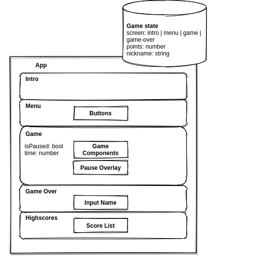

## Retropia Games presents:

--- 

# Whack a Zombie Mole

Game written in `React` to train up some skills.

You can play this game on the [itch.io](https://retrolove.itch.io/whack-a-zombie-mole).

## Component structure



---

## Technology

### Sound engine

I've used a very simple wave generator written in JS. Check its documentation [here](https://github.com/grumdrig/jsfxr) and test it using a [generator](https://sfxr.me/).

### Game engine

The whole game is written in `React`, and it's typed using `Typescript`.

---
## Config files

In order to compile this game, you need to create two config files:

* `src/config/production.ts`
* `src/config/development.ts`

Using following format: 

```js
export default {
  gameElements: 12,
  initialGameSpeed: 900,
  gameSpeedup: 20,
  speedupFactor: 5,
  maximumSpeed: 600,
  timeLimit: 90,
  badClickPoints: 10,
  goodClickPoints: 10,
  maxComboFactor: 4,
  apiUrl: "[score api url]",
  encryptionKey: "[encryption key]",
  maxNickLenght: 15,
};
```

You can run local score API using [this](https://github.com/Retrolove-Games/node-score-api) repo.

---

## Available Scripts

In the project directory, you can run:

### `yarn start`

Runs the app in the development mode.\
Open [http://localhost:3000](http://localhost:3000) to view it in the browser.

The page will reload if you make edits.\
You will also see any lint errors in the console.

### `yarn test`

Launches the test runner in the interactive watch mode.\
See the section about [running tests](https://facebook.github.io/create-react-app/docs/running-tests) for more information.

### `yarn build`

Builds the app for production to the `build` folder.\
It correctly bundles React in production mode and optimizes the build for the best performance.

The build is minified and the filenames include the hashes.\
Your app is ready to be deployed!

See the section about [deployment](https://facebook.github.io/create-react-app/docs/deployment) for more information.

### `yarn eject`

**Note: this is a one-way operation. Once you `eject`, you can’t go back!**

If you aren’t satisfied with the build tool and configuration choices, you can `eject` at any time. This command will remove the single build dependency from your project.

Instead, it will copy all the configuration files and the transitive dependencies (webpack, Babel, ESLint, etc) right into your project so you have full control over them. All of the commands except `eject` will still work, but they will point to the copied scripts so you can tweak them. At this point you’re on your own.

You don’t have to ever use `eject`. The curated feature set is suitable for small and middle deployments, and you shouldn’t feel obligated to use this feature. However, we understand that this tool wouldn’t be useful if you couldn’t customize it when you are ready for it.

---

## Local testing

If you want to test this game on a mobile device use `browser-sync`:

```bash
npm install -g browser-sync
browser-sync start --proxy http://localhost:3000
```
